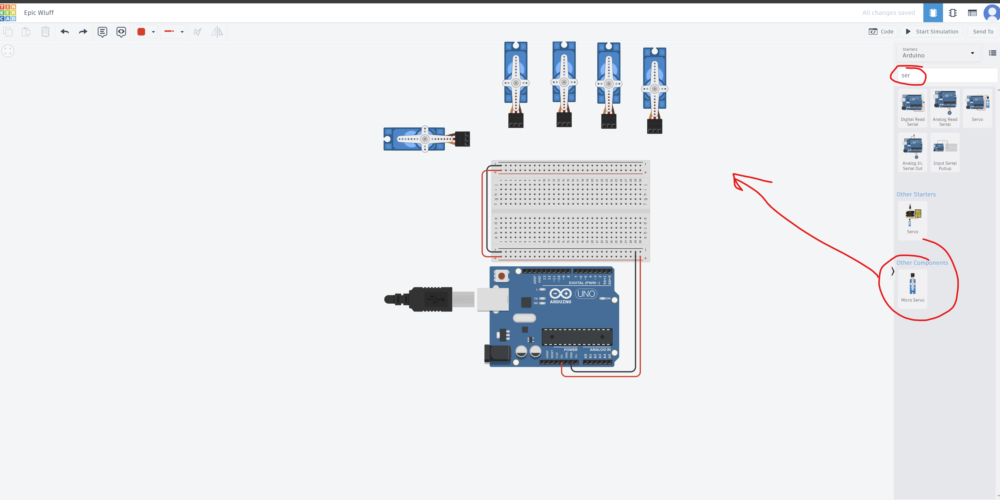
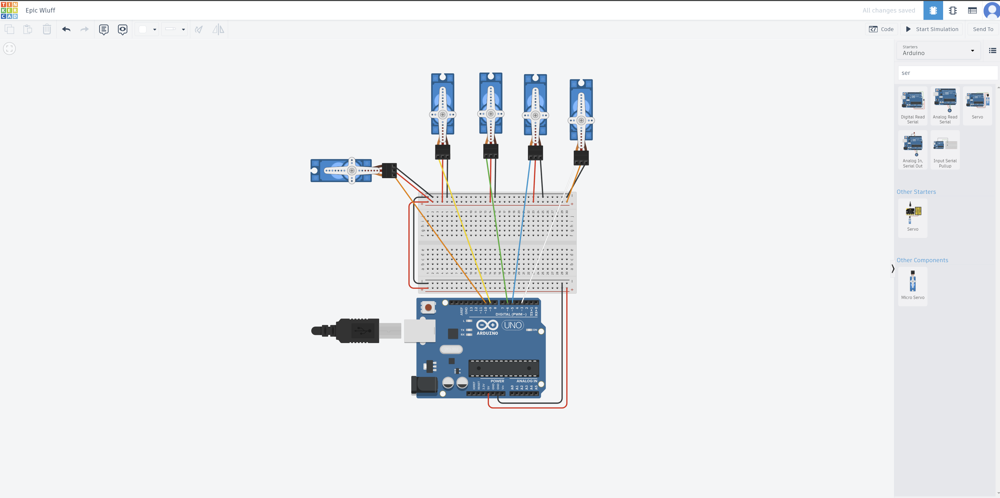
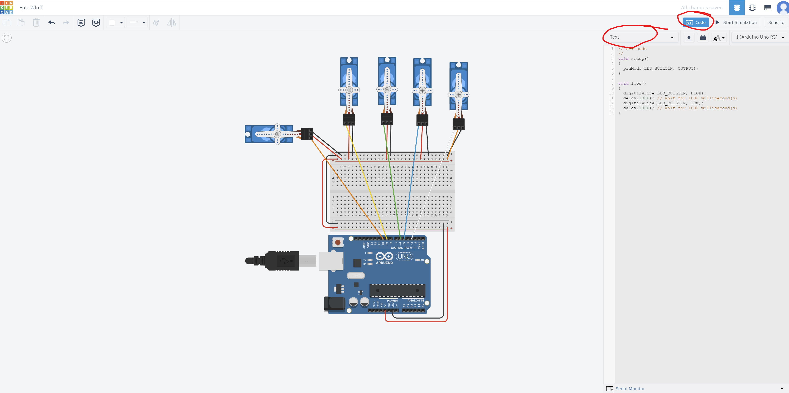
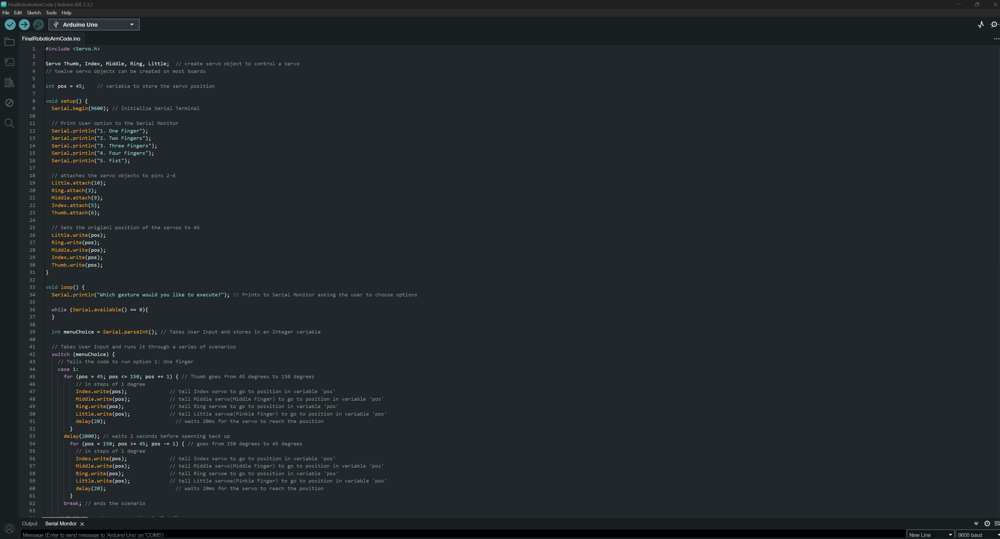
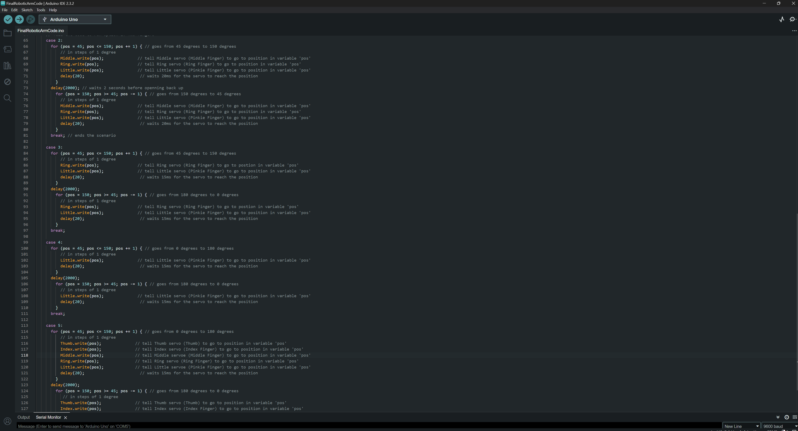
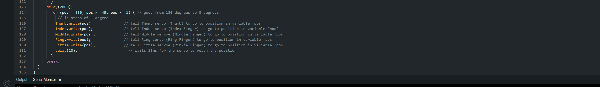

# Writing the Code!
This is the second section of the robotic arm tutorial what we have done is the starting steps of the project: creating a blueprint of the wiring and printing the parts needed to build the arm. Now what we are going to do in this section is create our own code which we are going to use to make the robotic arm function.

## Before We Start
Before we start, some of you who are following this tutorial may have a different function for your arm, unfortunately, I will not cover any other functions so you will have to figure out the code yourself, but feel free to use my code as a template. For those who are following this tutorial exactly please do not just copy the code there are two ways that I recommend that you proceed with this section: 
  > 1. **Challenge:** Try to make your own code as there are multiple ways to solve one problem
  2. It is okay to copy my code but while doing so please try to understand why I wrote what I wrote

## The Code
For the I recommend using two platforms one for simulation and the other for running the actual code that we will use for the final project.

1. The first platform that I will recomend that you use is an online site called [TinkerCad](https://www.tinkercad.com/). This an online site that will allow you to do several things related to engineering, but what we are going to use it for is the simulation of the code and servos.
2. The Second platform that I will recommend you use is the Arduino IDE there are other IDEs that you could but in my opinion, this is the best IDE for beginners who are using boards like Arduino.

### Simulation
1. First open up TinkerCad and log in (if you don't have an account already please create one) then navigate to the home tab if you are not on that page. What you are going to do is press the create button to create a project and then press Circuit.
   
2. Second you will go to the sidebar on the right and click on the menu where it says basic or starter then navigate to the Arduino Section. Then you will click on the breadboard option and drag it out onto the whitespace.
   
3. What you then do is search for the servo component and drag 5 of them out. You should see something under the other components header saying micro servos drag that component out onto the white space.
  
4. Then wire all the components together in the white space/
  
5. Finally navigate to the top right and press code, this is where you will type your code and run your simulation. This will help test your code so that once you are ready to move on to the next step there will be no problem when you actually run the program with the fully built arm. Also make sure to that you have text selected you that you can type in code rather than blocks.
  

Again I emphasize that go with the challenge and create your own code that may or may not be distinctly different than mine.

Here is my [code](Code/FinalRoboticArmCode.ino):

> **Reflection:** This is for people who did not copy the code that I provided. What did you learn while making your program? What was the hardest challenge/difficulty that you faced while developing your program? Is there any way that you could make it better?
> 
> **Reflection:** This is for people who did copy the code that I provided. What did you learn from my code? Is there any way that you could make it better?

## [<<< Previous Page](../Step1/README.md)            [ Next Page >>>](../Step3/README.md)
