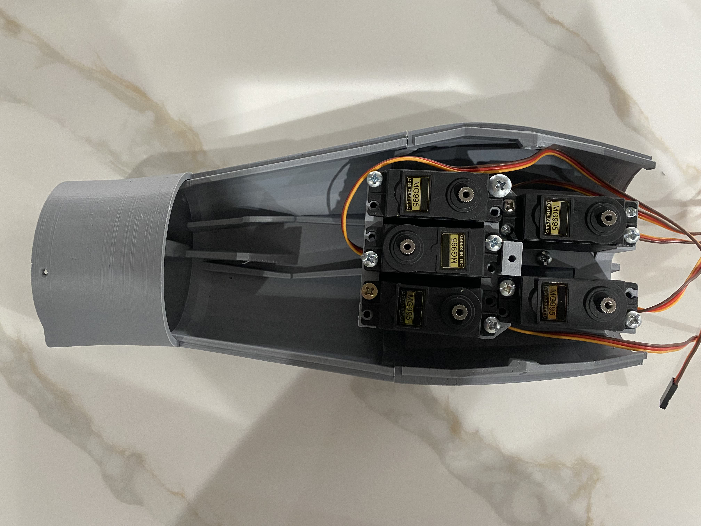
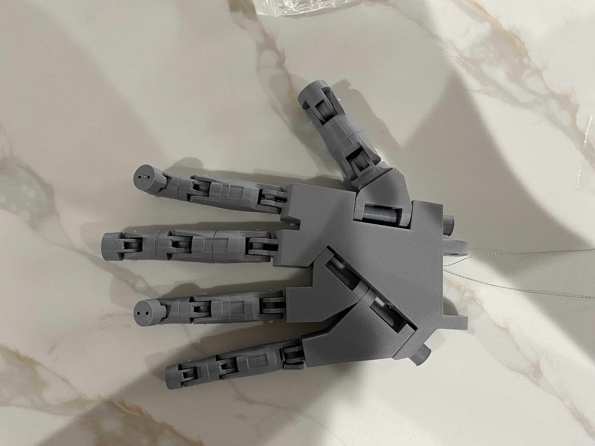
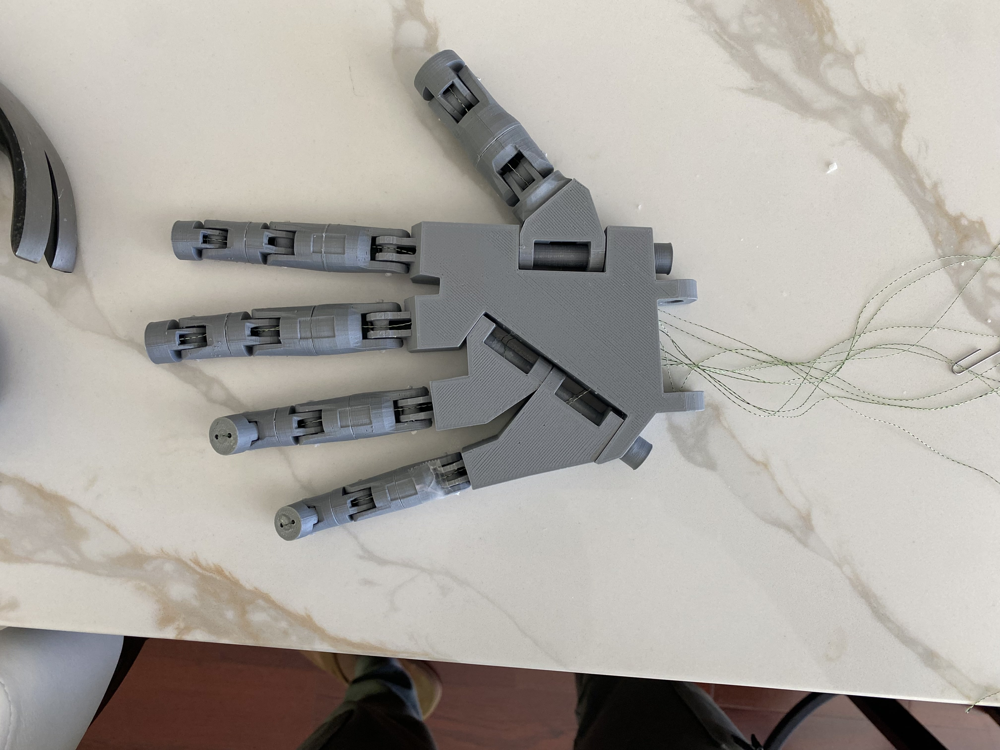
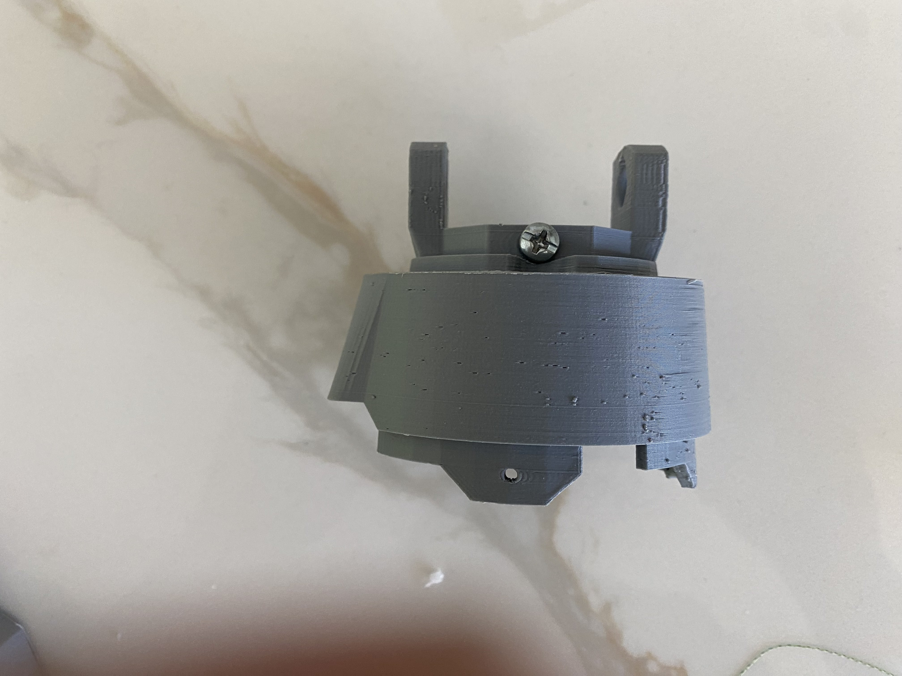
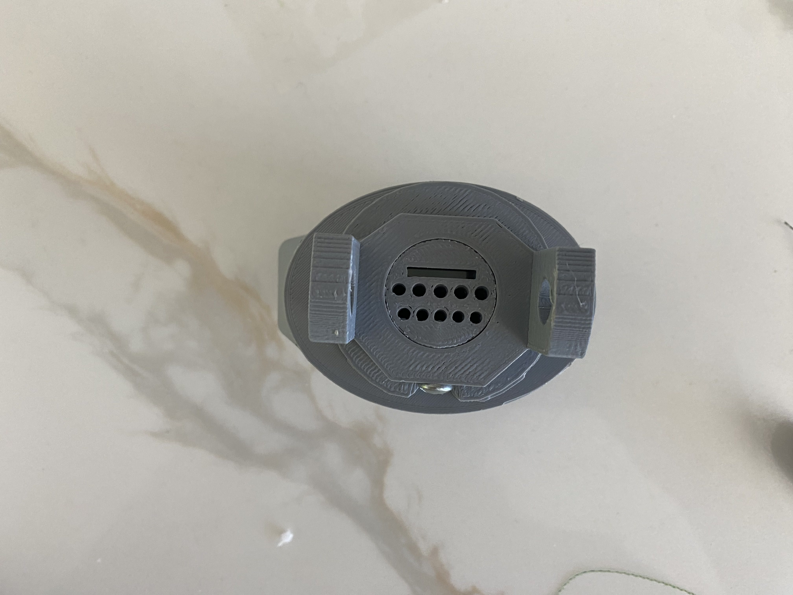
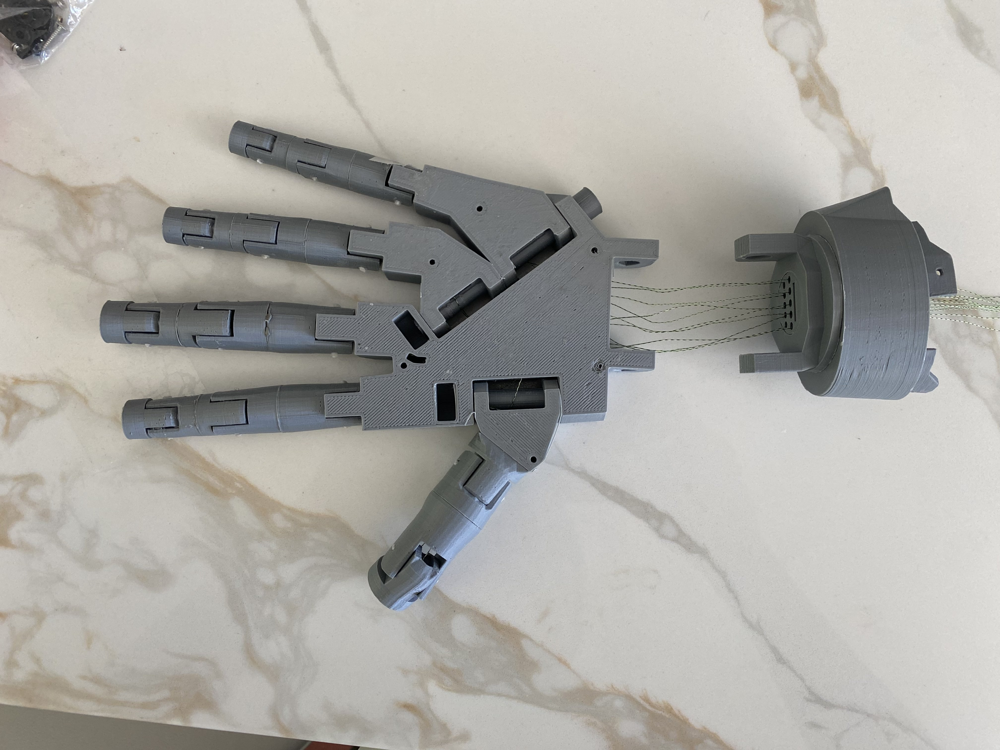
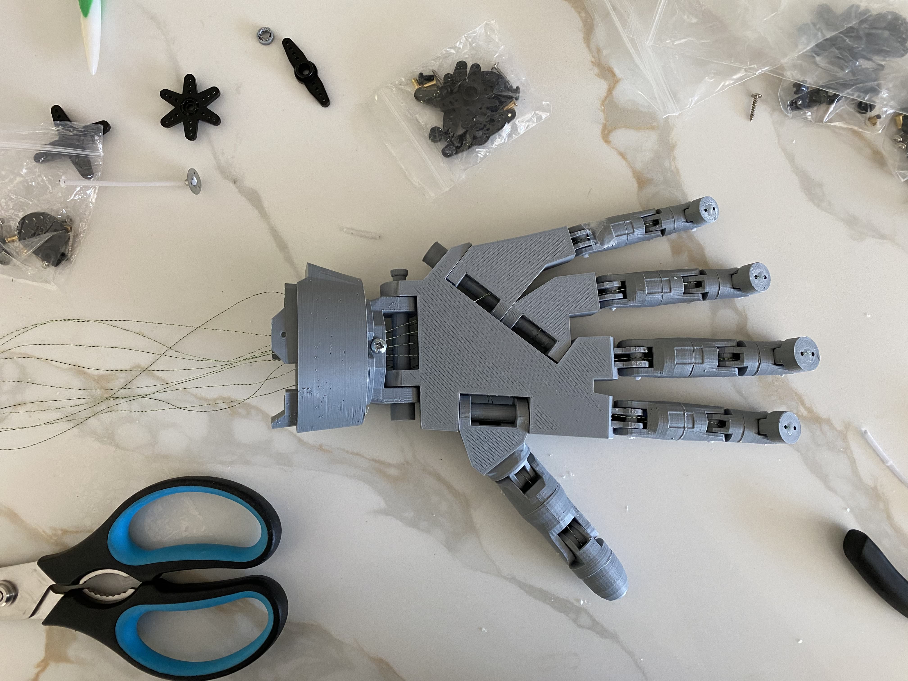
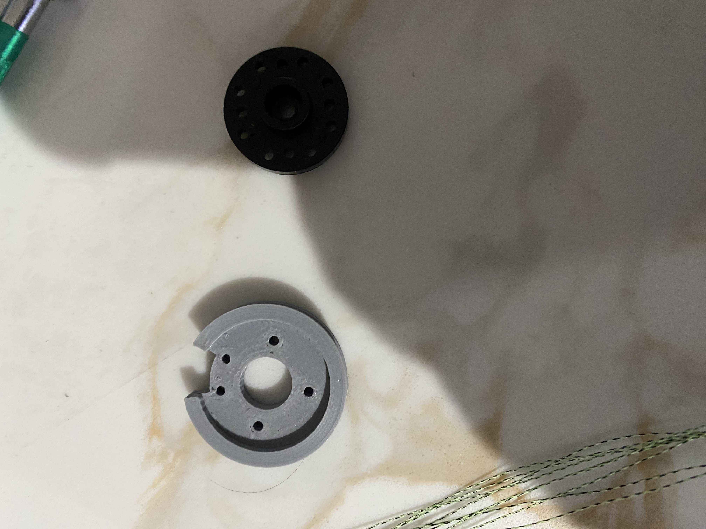
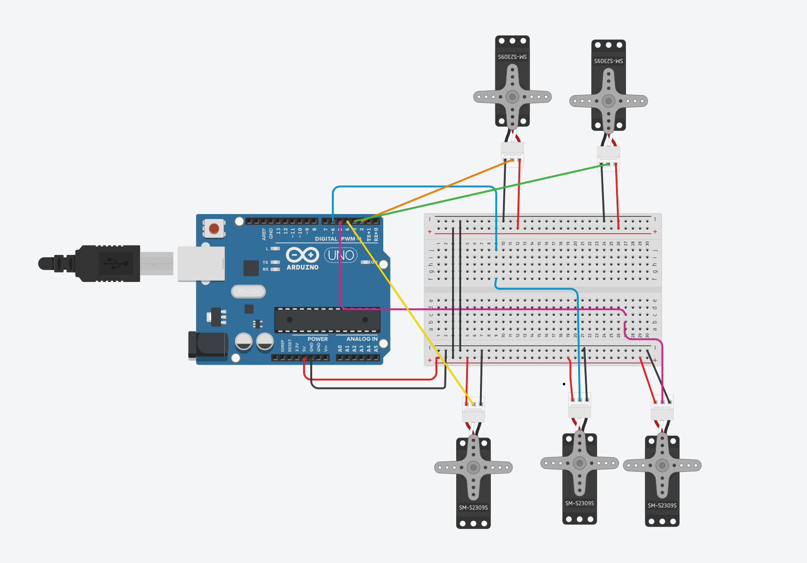

# Building The Arm!
In the last section what you did was write the code you will use for you robotic arm. In this section, we will be finally building the robotic arm using the part we 3d printed in the first section. This will be a good time to occasionally refer to the other resources that I gave on the main page as one of the resources is a video of the same project(slightly different) being built and it is great to follow along and look for the tiny things that I may not cover in this tutorial.

## Start with the Hand
Using the parts that you printed out earlier in the tutorial we will start by assembling the fingers and thumb you can see what to attach by looking for an indent on the bottom two parts of the finger then you can work your way up from there. Lastly, remember not to glue the fingertips because we will do that later on.

Remember not to glue the fingertip to the fingers as we will do that later

Next connect the joints of each finger with a candle wick(What I used but you don't have to use it if you can't), filament, or something similar. You may have to drill the holes in the joint so that they are wide enough to take whatever material you are using

Next connect the thumb to the palm using the [Bolt_Entretoise7.stl](../Step1/RoboticParts/Bolt_entretoise7.stl) as shown below:

Then connect the other finger using again candle wick, filament, or something similar as well as the [Bolt_Entretoise7.stl](../Step1/RoboticParts/Bolt_entretoise7.stl).

Then we move on to the forearm for a little bit where we will glue the [RobPart2V4.stl](../Step1/RoboticParts/robpart2V4.stl), [RobPart5V4.stl](../Step1/RoboticParts/robpart5V4.stl), and the [RotaWrist1V4.stl](../Step1/RoboticParts/RotaWrist1V4.stl) together.

Next, we screw in the [RobServoBedV6.stl](../Step1/RoboticParts/RobServoBedV6.stl) and screw in the servos as well. For this part, I didn't take a lot of pictures so I recommend that you look at the video for reference
[Video Part 1(7:16-9:02)](https://www.youtube.com/watch?v=vgtJY_rJWzo&t=306s)

Now, back to the hand, we are going to string the arm, for this part, I highly recommend that you watch the video to see what the act is supposed to be done just so you do not mess up because it is really painful to have to do the whole thing all over again, I speak from experience.
[Video Part 1(9:02-12:53)](https://www.youtube.com/watch?v=vgtJY_rJWzo&t=306s)

Once you have finished each finger I suggest that you immediately use super glue and/or tape at the fingertips to make sure that the string will not come out

Moving on what you are going to do next is your going to take the [WristGearsV5.stl](../Step1/RoboticParts/WristGearsV5.stl), [RotaWrist2V3.stl](../Step1/RoboticParts/RotaWrist2V3.stl), and the [RotaWrist3V3.stl](../Step1/RoboticParts/RotaWrist3V3.stl) and connect them.
[Video Part 1(13:49-14:15)](https://www.youtube.com/watch?v=vgtJY_rJWzo&t=306s)

Then you are going to string the wrist parts and the hand together and attach them with the [Bolt_Entretoise7.stl](../Step1/RoboticParts/Bolt_entretoise7.stl).
[Video Part 1(14:14-15:41)](https://www.youtube.com/watch?v=vgtJY_rJWzo&t=306s)

Then, we finally glue the fingertips onto the fingers thus finishing all that is left with the hand.
[Video Part 1(15:41-end)](https://www.youtube.com/watch?v=vgtJY_rJWzo&t=306s)

Next, We attach the part of the forearm we built to the hand, make sure to string the two parts together properly otherwise, it will not be possible to fix after you glue them together.
[Video Part 2(1:21-2:29)](https://www.youtube.com/watch?v=ZXy0Oxoixcg)

Then take the [servo-pulleyX5.stl](../Step1/RoboticParts/servo-pulleyX5.stl) and the circular gear that game with the [MG995 Servo](https://www.amazon.com/DWEII-Control-Angle180-Digital-Helicopter/dp/B09V4DZGD9/ref=sr_1_15?asc_source=01H8HFYCRM99TJ9FED7FSB1ZXC&dib=eyJ2IjoiMSJ9.6grwfkoyJ6HnBMbId0tZ-SsNYFFbEHub7-BdyEL43XhDYyUbwHrOFggkrCDLxJJynbS8cRs8hepFB3QHM_OyviPjBLocVihZlRVxyiyDr1P8QTCHtRFNmIh6xnCW8f_V-K4vuh1VMhVYQSkc6dBSpu0s1i6FFm0lCYonhSFX5V2tDyTMkTR1n62QVVw2_bRe4ovSPFq5K39vAA6IoQABM2pFRmjK_kUB0OMA7CCChrjajaAn1WNZ96io8WeHZECFXQI_3l2Csaa43NpL6o8-OJaIYqD33cX7BB8KXOEYNIM.K4QUcSvYJOfGUtULuF0z6Ywxlf9ayzLpfKCNPtGtNqI&dib_tag=se&keywords=mg995+servo&qid=1719715345&sr=8-15&tag=namespacebran689-20) and screw them together. Then attach them to the servos on the forearm.
[Video Part 2(2:33-5:15)](https://www.youtube.com/watch?v=ZXy0Oxoixcg)

After you have attached all the servo pulleys to the servos then you will take the string and wrap it around them. For this part, you need to watch the video because it is very tricky to do and also hard to notice.
[Video Part 2(4:57-6:53)](https://www.youtube.com/watch?v=ZXy0Oxoixcg)

Finally, it is time to do some wiring, so take out your breadboard, jumper wires, wire stripper, and Arduino UNO and start wiring with respect to the wiring schematic that you made in the first section.

After you have wired everything correctly connect your Arduino UNO to your PC and then pull up your code file make sure that your IDE is connected to your board then upload the program and test it out.

Once everything is tested and working then take the [RobPart3V4.stl](../Step1/RoboticParts/robpart3V4.stl) and the [RobPart4V4.stl](../Step1/RoboticParts/robpart4V4.stl) and glue them together then attach to the forearm.\

Finally, you could attach the [RobCap3V2.stl](../Step1/RoboticParts/robcap3V2.stl) to the arm, but you are going to have to rewire everything so I didn't.

And Voila you are done!!! Congrats on building your very own robotic arm!

## [<<< Previous Page](../Step2/README.md)            [ Next Page >>>](../Step4/README.md)
