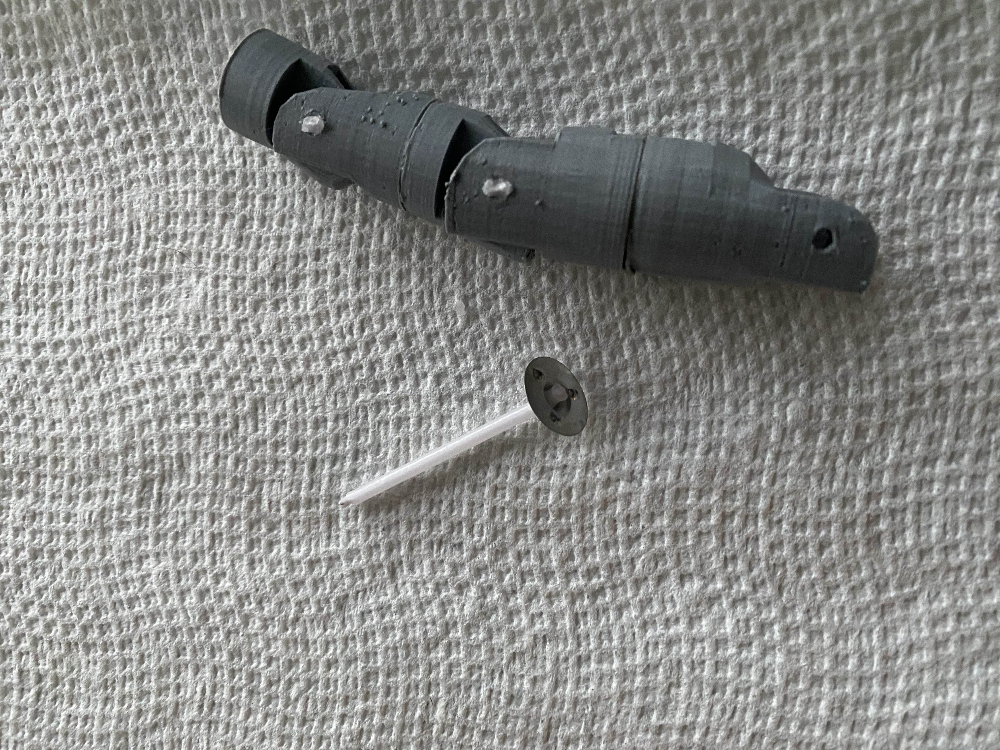
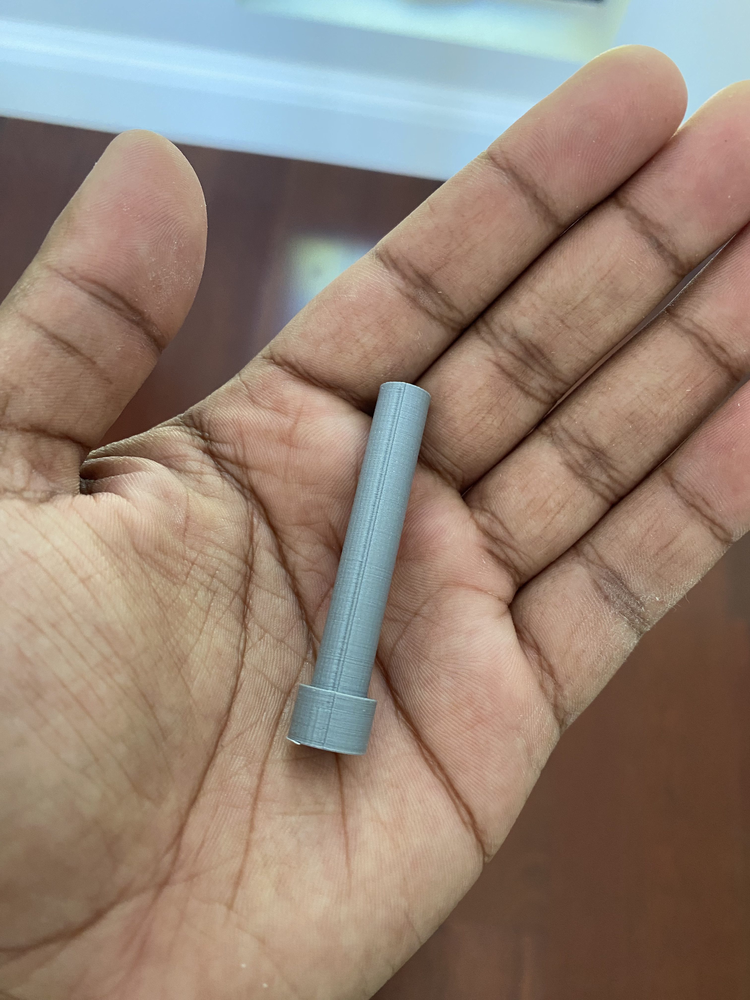
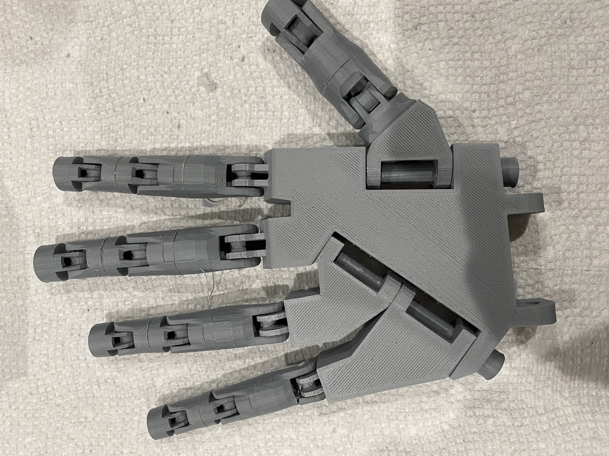
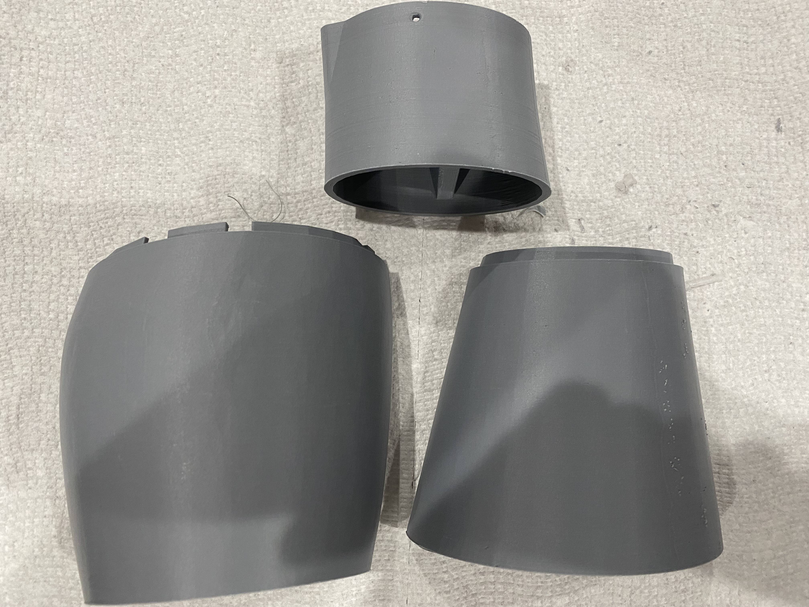

# Building The Arm!
In the last section what you did was write the code you will use for you robotic arm. In this section, we will be finally building the robotic arm using the part we 3d printed in the first section. This will be a good time to occasionally refer to the other resources that I gave on the main page as one of the resources is a video of the same project(slightly different) being built and it is great to follow along and look for the tiny things that I may not cover in this tutorial.

## Start with the Hand
Using the parts that you printed out earlier in the tutorial we will start by assembling the fingers and thumb you can see what to attach by looking for an indent on the bottom two parts of the finger then you can work your way up from there. Lastly, remember not to glue the fingertips because we will do that later on.

Remember not to glue the fingertip to the fingers as we will do that later

Next connect the joints of each finger with a candle wick(What I used but you don't have to use it if you can't), filament, or something similar. You may have to drill the holes in the joint so that they are wide enough to take whatever material you are using

Next connect the thumb to the palm using the [Bolt_Entretoise7.stl](../Step1/RoboticParts/Bolt_entretoise7.stl) as shown below:

Then connect the other finger using again candle wick, filament, or something similar as well as the [Bolt_Entretoise7.stl](../Step1/RoboticParts/Bolt_entretoise7.stl).

Then we move on to the forearm for a little bit where we will glue the [RobPart2V4.stl](../Step1/RoboticParts/robpart2V4.stl), [RobPart5V4.stl](../Step1/RoboticParts/robpart5V4.stl), and the [RotaWrist1V4.stl](../Step1/RoboticParts/RotaWrist1V4.stl) together.

Next, we screw in the [RobServoBedV6.stl](../Step1?RoboticParts/RobServoBedV6.stl) and screw in the servos as well. For this part, I didn't take a lot of pictures so I recommend that you look at the video for reference
[Video Part 1(7:16-9:02)](https://www.youtube.com/watch?v=vgtJY_rJWzo&t=306s)
