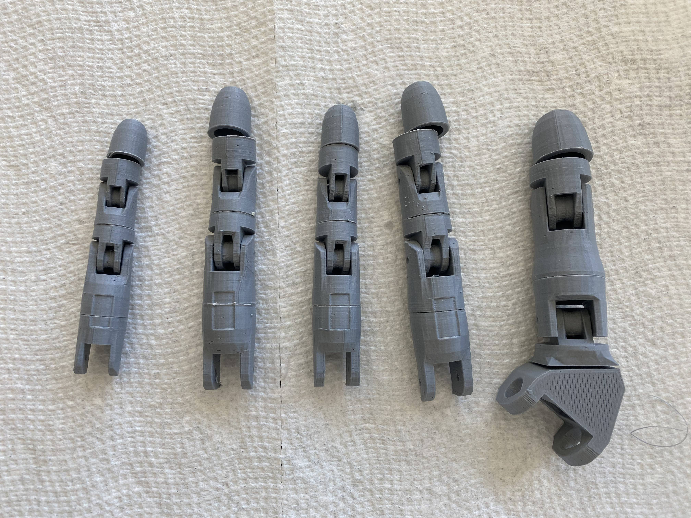

# Building The Arm!
In the last section what you did was write the code you will use for you robotic arm. In this section, we will be finally building the robotic arm using the part we 3d printed in the first section. This will be a good time to occasionally refer to the other resources that I gave on the main page as one of the resources is a video of the same project(slightly different) being built and if is great to follow along and look for the tiny things that I may not cover in this tutorial.

## Start with the Hand
Using the parts that you printed out earlier in the tutorial we will start by assembling the fingers and thumb you can see what to attach by looking for an indent on the bottom two parts fo the finger then you can work you way up from there. Lastly, remember not to glue the fingertips because we will do that later on.

